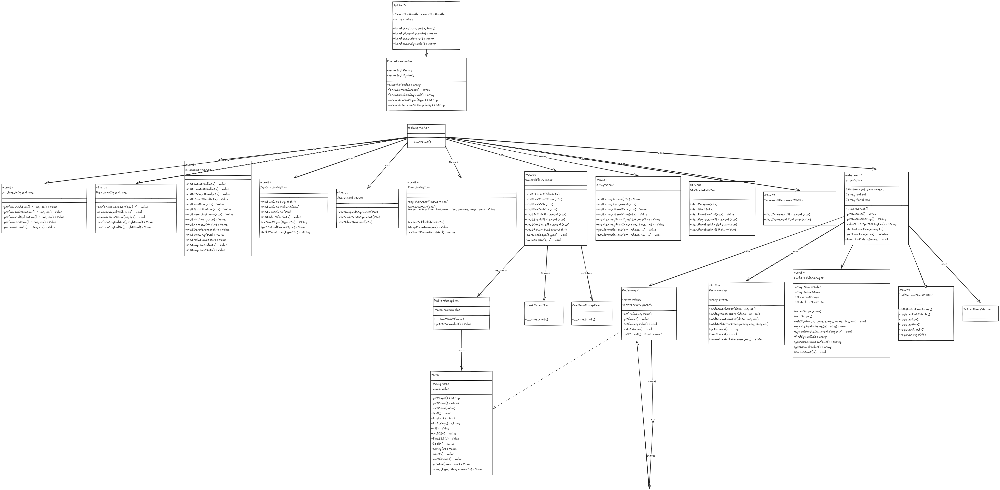

# Documentación Técnica – Intérprete Golampi

## 1. Diagrama de Clases

### 1.1 Lectura técnica del diagrama

El diagrama de clases se organiza en cuatro capas que cooperan durante una ejecución:

1. **Orquestación/API**
	- `ExecutionHandler` es la puerta de entrada.
	- Construye `InputStream`, `GolampiLexer`, `CommonTokenStream`, `GolampiParser` y finalmente el árbol (`program`).
	- Si no hay errores léxicos/sintácticos, crea `GolampiVisitor`, ejecuta `visit(tree)` y devuelve `output`, `errors` y `symbolTable` formateados.

2. **Interpretación (Visitor)**
	- `GolampiVisitor` extiende `BaseVisitor` y agrega comportamiento mediante traits especializados:
	  - expresiones y aritmética,
	  - declaraciones/asignaciones,
	  - control de flujo,
	  - funciones,
	  - arreglos,
	  - funciones embebidas.
	- Esta composición por traits permite separar responsabilidades sin duplicar estado.

3. **Runtime**
	- `Environment` modela el entorno de ejecución con encadenamiento padre-hijo.
	- `define`, `get`, `set` y `exists` resuelven identificadores buscando desde el scope actual hacia arriba.
	- `Value` encapsula los tipos del lenguaje (`int32`, `float64`, `bool`, `string`, `array`, `pointer`, `nil`) y su representación.

4. **Servicios transversales del visitor**
	- `ErrorHandler`: recolección uniforme de errores.
	- `SymbolTableManager`: registro, actualización, fusión y ordenamiento final de símbolos.

### 1.2 Relaciones clave entre clases

- `ExecutionHandler -> GolampiVisitor`: delega toda la semántica al visitor.
- `BaseVisitor -> Environment`: mantiene el entorno activo (`$environment`) y lo reemplaza temporalmente al entrar a funciones/bloques.
- `BaseVisitor -> SymbolTableManager`: mantiene dos estructuras separadas:
  - **entorno semántico** (`Environment`) para resolver valores en tiempo de ejecución,
  - **tabla de símbolos** para reporte/inspección.
- `StatementVisitor::visitProgram` aplica tres fases:
  1) hoisting de funciones,
  2) ejecución de globales,
  3) ejecución de `main`.

### 1.3 Decisiones de diseño importantes

- **Separación Environment vs SymbolTable:** evita mezclar resolución semántica con auditoría/visualización.
- **Traits por dominio:** reduce acoplamiento y facilita mantenimiento del visitor.
- **Scopes explícitos (`enterScope`/`exitScope`):** permite conservar trazabilidad de línea/columna y ámbito en cada símbolo.
- **Fusión controlada de símbolos:** cuando una variable cambia de valor, no se duplica la declaración; se actualiza su entrada por identidad de declaración.

---

## 2. Flujo de Procesamiento de la Tabla de Símbolos

El siguiente diagrama muestra exactamente cómo se construye y actualiza la tabla de símbolos durante la ejecución del archivo `test_controlFlujo.golampi`.

### 2.0 Resumen operativo

Durante la ejecución, el intérprete maneja dos corrientes en paralelo:

- **Ejecución semántica:** vive en `Environment` (valores reales usados por expresiones y sentencias).
- **Trazabilidad de símbolos:** vive en `symbolTable` y `scopeStack` (snapshot de declaraciones y valores para reporte).

La tabla de símbolos no reemplaza al entorno; lo complementa para análisis y depuración.

### 2.1 Flujo General (Pipeline completo)

**Detalle por etapas:**

1. **Entrada y parsing**
	- Se transforma el código fuente a tokens (`Lexer`) y luego a AST (`Parser`).
	- Si hay errores léxicos/sintácticos, se detiene el proceso y no se ejecuta semántica.

2. **Hoisting (Pase 1)**
	- `visitProgram` registra primero funciones de usuario (excepto `main`) con `registerUserFunction`.
	- Cada función queda disponible en `this->functions` antes de ejecutar otras sentencias.

3. **Globales (Pase 2)**
	- Se recorren nodos no-función para ejecutar declaraciones/constantes globales.
	- Si se declara símbolo global, entra directo a `symbolTable` (no a `scopeStack`).

4. **main (Pase 3)**
	- `executeMain` crea un `Environment` hijo del global.
	- Se hace `enterScope('function:main')` y los símbolos de `main` se apilan en ese scope.

5. **Bloques internos**
	- Estructuras como `for`, `if-block`, `switch` crean scopes hijos en `scopeStack`.
	- Declaraciones usan `addSymbol`; mutaciones usan `updateSymbolValue`.

6. **Cierre y salida**
	- `exitScope()` fusiona símbolos del scope saliente.
	- Al cerrar `function:main`, los símbolos pasan a `symbolTable` final.
	- `getSymbolTable()` ordena por línea, columna y orden de declaración.

### 2.2 Detalle: Gestión de Scopes y la Pila (scopeStack)

**Cómo se mueve la información en la pila:**

- `enterScope(nombre)` hace **push** de un frame con `id`, `name` y `symbols[]` vacío.
- `addSymbol(...)` siempre escribe en el frame superior cuando hay scopes activos.
- `updateSymbolValue(id, nuevoValor)` busca de arriba hacia abajo (scope más interno a externo).
- `exitScope()` hace **pop** del frame actual y fusiona sus símbolos:
  - si el scope es `function:*`, fusiona a `symbolTable` final,
  - si es bloque/ciclo, fusiona al scope padre inmediato.

Esto permite que variables locales de bloques queden asociadas semánticamente a la función contenedora en el reporte final.

### 2.3 Detalle: Ciclo de vida de un símbolo (variable `x`)

**Interpretación del ciclo:**

- La declaración inicial de `x` crea una entrada única identificada por:
  `identifier + scope + line + column`.
- Operaciones posteriores (`+=`, `++`, `--`) no crean nuevas filas para esa misma declaración.
- En su lugar, `updateSymbolValue` modifica el campo `value` de la entrada existente.
- La entrada se vuelve parte de la tabla final al cerrar el scope de función con `exitScope()`.

### 2.4 Método `exitScope()` – Lógica de fusión

 – Lógica de fusión.png>)

**Regla exacta de fusión (`mergeIntoArray`)**

- Se compara contra el destino usando cuatro claves:
  - `identifier`,
  - `scope`,
  - `line`,
  - `column`.
- Si ya existe una entrada con esa misma identidad de declaración, solo se actualiza `value`.
- Si no existe, se agrega un nuevo registro.

**Efecto práctico:**

- Se preservan variables homónimas en distintos ámbitos (ej. `x` en `function:main` y `x` en `if-block`).
- Se evita duplicar una misma declaración cada vez que cambia su valor durante la ejecución.

---

## 3. Ejemplo Concreto: Tabla de Símbolos de `test_controlFlujo.golampi`

Esta es la tabla resultante después de ejecutar el archivo completo, ordenada por línea y columna tal como la produce `getSymbolTable()`:

| # | Identificador | Tipo | Valor final | Ámbito | Línea | Columna |
|---|---------------|------|-------------|--------|-------|---------|
| 1 | `main` | `function` | `nil` | `global` | 3 | 0 |
| 2 | `x` | `int32` | `15` | `function:main` | 5 | 4 |
| 3 | `i` | `int32` | `3` | `for` | 19 | 8 |
| 4 | `j` | `int32` | `3` | `for` | 25 | 8 |
| 5 | `nota` | `int32` | `85` | `function:main` | 31 | 4 |
| 6 | `x` | `int32` | `30` | `if-block` | 37 | 16 |
| 7 | `dia` | `int32` | `3` | `function:main` | 47 | 4 |
| 8 | `y` | `int32` | `200` | `if-block` | 61 | 8 |
| 9 | `k` | `int32` | `4` | `for` | 68 | 8 |
| 10 | `contador` | `int32` | `0` | `function:main` | 81 | 4 |
| 11 | `m` | `int32` | `2` | `for` | 89 | 8 |
| 12 | `n` | `int32` | `10` | `for` | 90 | 8 |

> **Nota sobre `x` duplicado:** Las dos entradas para `x` son válidas porque pertenecen a ámbitos distintos (`function:main` en línea 5 y `if-block` en línea 37). El sistema los diferencia por la combinación `identifier + scope + line + column`.

### 3.1 Lectura fila por fila de la tabla

- **Fila 1 · `main` (`function`, `global`, `nil`, L3:C0)**
	- Se registra al ejecutar `executeMain` y representa la declaración de la función principal en ámbito global.
	- Su valor es `nil` porque no almacena dato de ejecución, solo metadato de función.

- **Fila 2 · `x` (`int32`, `function:main`, `15`, L5:C4)**
	- Nace con `x := 10`.
	- Luego se actualiza por `x += 5` (`15`), `x++` (`16`) y `x--` (`15`).
	- Se conserva una sola entrada porque todas esas operaciones afectan la misma declaración.

- **Fila 3 · `i` (`int32`, `for`, `3`, L19:C8)**
	- Se declara en `for i := 0; i < 3; i++`.
	- El valor final `3` corresponde al estado al salir del ciclo (después del último incremento que rompe la condición).

- **Fila 4 · `j` (`int32`, `for`, `3`, L25:C8)**
	- Se declara en `for var j int32 = 0; j < 3; j++`.
	- Igual que `i`, termina con `3` al concluir la evaluación del ciclo.

- **Fila 5 · `nota` (`int32`, `function:main`, `85`, L31:C4)**
	- Se define antes del `if-else-if`.
	- No se reasigna después, por eso mantiene `85`.

- **Fila 6 · `x` (`int32`, `if-block`, `30`, L37:C16)**
	- Es una declaración distinta de la `x` de `main`, creada dentro del bloque `else if nota >= 80`.
	- Su ámbito (`if-block`) justifica que coexista con la otra `x`.

- **Fila 7 · `dia` (`int32`, `function:main`, `3`, L47:C4)**
	- Se declara antes de `switch dia`.
	- Solo se usa para selección de caso; no cambia de valor.

- **Fila 8 · `y` (`int32`, `if-block`, `200`, L61:C8)**
	- Se declara en `if true { y := 200 ... }`.
	- Al salir del bloque, el símbolo se fusiona para trazabilidad, conservando su scope `if-block`.

- **Fila 9 · `k` (`int32`, `for`, `4`, L68:C8)**
	- Se declara en `for k := 0; k < 5; k++`.
	- El `continue` en `k == 2` no altera el contador; el `break` en `k == 4` corta el ciclo con valor final `4`.

- **Fila 10 · `contador` (`int32`, `function:main`, `0`, L81:C4)**
	- Se inicializa en `3` y luego se decrementa dentro de `for contador > 0`.
	- Finaliza en `0` al terminar el ciclo estilo while.

- **Fila 11 · `m` (`int32`, `for`, `2`, L89:C8)**
	- Se declara en `for m := 0; m < 2; m++`.
	- Termina en `2` al completar iteraciones para `m=0` y `m=1`.

- **Fila 12 · `n` (`int32`, `for`, `10`, L90:C8)**
	- Se declara dentro del cuerpo del `for` como `n := m * 10`.
	- En la última iteración efectiva (`m=1`) queda `10`, que es el valor que persiste en la traza del scope del ciclo.

### 3.2 Qué valida este ejemplo

- El sistema distingue símbolos por identidad de declaración (`identifier + scope + line + column`), no solo por nombre.
- Los cambios de valor actualizan entradas existentes, en lugar de crear duplicados por cada asignación.
- Los scopes internos (`for`, `if-block`) se preservan en el reporte final para explicar de dónde provino cada símbolo.
- El orden final respeta ubicación en código (línea/columna), facilitando correlación directa con el archivo fuente.

---

## 4. Notas de Arquitectura

- **Hoisting:** Las funciones de usuario se registran en el `Pase 1` de `visitProgram` antes de que se ejecute cualquier código, permitiendo llamadas hacia adelante (forward references).
- **Paso por valor vs. referencia:** Los arreglos se copian profundamente (`deepCopyArray`) al pasar como parámetro por valor. Al pasar con `&`, se crea un `Value::pointer` que apunta al `Environment` del llamador.
- **Cortocircuito:** Los operadores `&&` y `||` implementan evaluación perezosa: si el lado izquierdo determina el resultado, el lado derecho no se evalúa.
- **Inmutabilidad de constantes:** El trait `AssignmentVisitor` verifica `isConstant()` antes de cualquier asignación; si es constante, genera un error semántico sin modificar el valor.