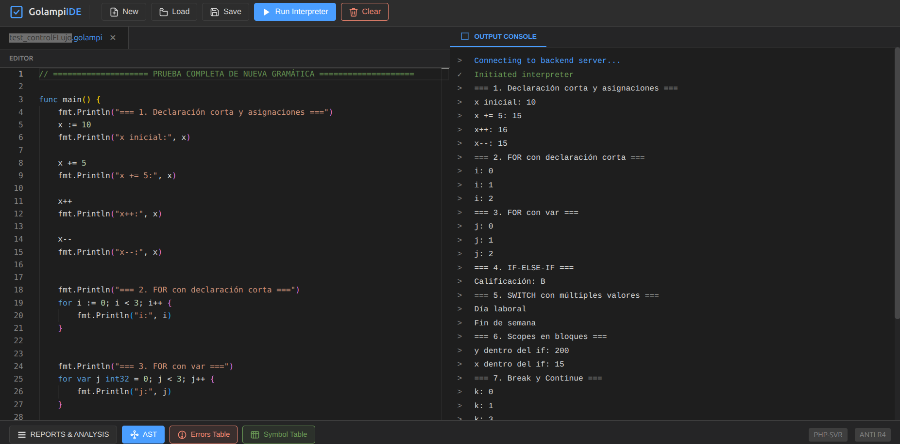

# Manual de Usuario – Golampi IDE

Este manual explica, **paso a paso**, cómo instalar, abrir, usar y entender los reportes de la herramienta Golampi IDE.

---

## 1) ¿Qué es Golampi IDE?

Golampi IDE es una interfaz web para escribir y ejecutar código Golampi usando:

- **Frontend**: Svelte + Monaco Editor.
- **Backend**: PHP + ANTLR4.
- **Reportes**: consola de salida, tabla de errores y tabla de símbolos.

---

## 2) Requisitos previos

Antes de iniciar, verifica que tu equipo tenga:

- `php` 8.0 o superior
- `composer`
- `node` y `npm`
- Navegador web moderno (Chrome, Firefox, Edge)

Verificación rápida:

```bash
php -v
composer -V
node -v
npm -v
```

---

## 3) Instalación y arranque (paso a paso)

### Paso 1. Abrir el proyecto

Ubícate en la raíz del repositorio:

```bash
cd /ruta/al/proyecto/OLC2_Proyecto1_202308204
```

### Paso 2. Instalar dependencias del Backend

```bash
cd Backend
composer install
cd ..
```

### Paso 3. Instalar dependencias del Frontend

```bash
cd Frontend
npm install
cd ..
```

### Paso 4. Iniciar todo automáticamente (recomendado)

Desde la raíz del proyecto:

```bash
chmod +x start.sh
./start.sh
```

Esto inicia:

- Frontend: `http://localhost:5173`
- Backend API: `http://localhost:8000/api`

### Paso 5. Abrir la herramienta

En el navegador entra a:

`http://localhost:5173`

> Si usas `Ctrl + C` en la terminal donde corre `start.sh`, se detienen frontend y backend.

---

## 4) Recorrido completo de la interfaz

### 4.1 Captura general de la interfaz



### 4.2 ¿Qué hace cada zona?

1. **Barra superior (toolbar)**
	 - Contiene los botones de archivo y ejecución.

2. **Editor central (Monaco)**
	 - Aquí escribes/pegas tu código Golampi.
	 - Tiene resaltado de sintaxis y sugerencias/autocompletado.

3. **Panel derecho: Output Console**
	 - Muestra mensajes del sistema, salida de `fmt.Println`, errores y estado final.

4. **Barra inferior: Reports & Analysis**
	 - Botones para abrir los reportes de análisis (errores y símbolos).

5. **Etiquetas de tecnología (abajo derecha)**
	 - `PHP-SVR` y `ANTLR4` son etiquetas informativas del stack.

---

## 5) Botón por botón (explicado en detalle)

### 5.1 Barra superior

- **New**
	- Crea un archivo nuevo con plantilla base (`package main` + `func main`).
	- Muestra confirmación para descartar cambios no guardados.

- **Load**
	- Abre selector de archivos para cargar un archivo con extensión `.go`.
	- Al cargarlo, su contenido se coloca en el editor y actualiza el nombre de archivo.

- **Save**
	- Descarga el contenido actual del editor como archivo de texto.
	- Usa como nombre el archivo actual (por defecto `main.go`, o el nombre del último archivo cargado).

- **Run Interpreter**
	- Envía el código al backend y ejecuta el intérprete.
	- Mientras ejecuta, el editor queda temporalmente en solo lectura para evitar cambios durante la ejecución.
	- Al terminar, actualiza consola, errores y tabla de símbolos.

- **Clear**
	- Limpia salida de consola, lista de errores y tabla de símbolos en pantalla.
	- No borra automáticamente el código del editor.

### 5.2 Barra inferior

- **REPORTS & ANALYSIS**
	- Botón de sección visual (encabezado de área de reportes).

- **AST**
	- Botón reservado para análisis AST.
	- Actualmente no muestra una vista AST funcional en esta interfaz.

- **Errors Table**
	- Abre un modal con la tabla de errores de la **última ejecución**.

- **Symbol Table**
	- Abre un modal con la tabla de símbolos de la **última ejecución**.

### 5.3 Modal de reportes

- Se cierra con botón `×` o haciendo clic fuera del contenido.
- El mismo contenedor modal se reutiliza para errores o símbolos.

---

## 6) Crear, editar y ejecutar código

### 6.1 Crear código nuevo

1. Haz clic en **New**.
2. En el editor, escribe tu programa Golampi.

Ejemplo mínimo:

```golang
package main

func main() {
		x := 10
		fmt.Println("x:", x)
}
```

### 6.2 Editar código

- Escribe directamente en el editor.
- Puedes copiar/pegar código desde otros archivos.
- Puedes cargar un archivo existente con **Load**.

### 6.3 Ejecutar código

1. Clic en **Run Interpreter**.
2. Revisa el panel **OUTPUT CONSOLE**.
3. Si hay errores, abre **Errors Table**.
4. Para revisar variables y ámbitos, abre **Symbol Table**.

### 6.4 Guardar tu trabajo

- Haz clic en **Save** para descargar el archivo actualizado.

---

## 7) ¿Cómo interpretar los reportes?

### 7.1 Consola de salida

La consola mezcla mensajes de infraestructura y salida del programa:

- `system`: mensajes del proceso (inicio de conexión, etc.)
- `success`: ejecución finalizada correctamente
- `error`: fallas de conexión o errores de ejecución
- `output`: líneas impresas por el programa

Guía rápida:

- Si ves solo `output` y `success`, la ejecución fue correcta.
- Si aparece `error`, revisa detalle en **Errors Table**.

### 7.2 Tabla de errores


Columnas:

- `#`: identificador interno del error
- `Tipo`: categoría (Léxico, Sintáctico, Semántico, Ejecución, etc.)
- `Descripcion`: mensaje específico del problema
- `Line`: línea donde se detectó
- `Column`: columna donde se detectó

Cómo usarla correctamente:

1. Prioriza el **primer error** de la lista (muchos errores siguientes son cascada).
2. Corrige línea y columna reportadas.
3. Ejecuta de nuevo para verificar.

### 7.3 Tabla de símbolos


Columnas:

- `Identificador`: nombre de variable/función
- `Tipo`: tipo inferido o declarado (`int32`, `function`, etc.)
- `Valor`: valor final al terminar ejecución
- `Ambito`: `global`, `function:main`, `for`, `if-block`, etc.
- `Line` y `Column`: ubicación de declaración

Cómo leerla:

- Si un nombre aparece repetido en distinto ámbito (ej. `x` en `function:main` y `if-block`), **no es error**; son declaraciones diferentes.
- El valor mostrado es el **valor final registrado** para esa declaración al cerrar su scope.

---

## 8) Ejemplo de sesión de uso (completa)

### Escenario A: ejecución correcta

1. Clic en **New**.
2. Escribe:

```golang
package main

func main() {
		a := 5
		b := 7
		suma := a + b
		fmt.Println("Suma:", suma)
}
```

3. Clic en **Run Interpreter**.
4. En consola debería aparecer una salida similar a `Suma: 12` y mensaje de éxito.
5. Abre **Symbol Table** y verifica `a`, `b`, `suma` con sus valores.

### Escenario B: detectar y corregir errores

1. Modifica una línea con un error (por ejemplo, usa un identificador no declarado).
2. Ejecuta con **Run Interpreter**.
3. Abre **Errors Table** y ubica `Tipo`, `Line`, `Column`.
4. Corrige en editor y vuelve a ejecutar.

---

## 9) Capturas incluidas y qué revisar en cada una

- **Interfaz general**: [interfaz.png](../img/interfaz.png)
	- Úsala para ubicar toolbar, editor, consola y barra de reportes.

- **Reporte de errores**: [tabla de errores.png](../img/tabla%20de%20errores.png)
	- Úsala para aprender a corregir código con línea/columna.

- **Reporte de símbolos**: [tabla de simbolos.png](../img/tabla%20de%20simbolos.png)
	- Úsala para validar variables, tipo, ámbito y valor final.

---

## 10) Problemas comunes y solución rápida

- **No carga la interfaz web**
	- Verifica que frontend esté en `http://localhost:5173`.

- **Error de conexión al ejecutar**
	- Verifica backend en `http://localhost:8000/api`.
	- Revisa si `start.sh` sigue corriendo en terminal.

- **Load no muestra archivos**
	- Asegúrate de usar extensión `.go`.

- **No veo símbolos/errores en modal**
	- Ejecuta primero el código con **Run Interpreter**; los modales muestran la última ejecución.

---

## 11) Recomendaciones de uso

- Ejecuta frecuentemente en bloques pequeños de código.
- Guarda versiones con **Save** antes de cambios grandes.
- Si aparecen muchos errores, corrige primero el más temprano (menor línea).
- Usa la tabla de símbolos para verificar scopes y valores finales en `for`, `if` y funciones.

