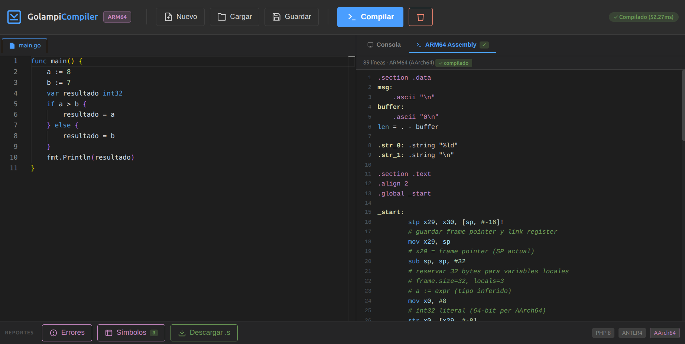

# Manual de Usuario – Golampi IDE

Este manual explica, **paso a paso**, cómo instalar, abrir, usar y entender los reportes de la herramienta Golampi IDE.

---

## 1) ¿Qué es Golampi IDE?

Golampi IDE es una interfaz web para escribir código en el lenguaje **Golampi** y compilarlo a **código ARM64** (ensamblador para arquitectura ARM de 64 bits):

- **Frontend**: Svelte + Monaco Editor.
- **Backend**: PHP + ANTLR4 para análisis léxico/sintáctico.
- **Compilador**: ARM64Generator que traduce Golampi a ensamblador.
- **Reportes**: tabla de errores de compilación y tabla de símbolos con análisis semántico.

---

## 2) Requisitos previos

Antes de iniciar, verifica que tu equipo tenga:

- `php` 8.0 o superior
- `composer`
- `node` y `npm`
- Navegador web moderno (Chrome, Firefox, Edge)

Verificación rápida:

```bash
php -v
composer -V
node -v
npm -v
```

---

## 3) Instalación y arranque (paso a paso)

### Paso 1. Abrir el proyecto

Ubícate en la raíz del repositorio:

```bash
cd /ruta/al/proyecto/OLC2_Proyecto1_202308204
```

### Paso 2. Instalar dependencias del Backend

```bash
cd Backend
composer install
cd ..
```

### Paso 3. Instalar dependencias del Frontend

```bash
cd Frontend
npm install
cd ..
```

### Paso 4. Iniciar todo automáticamente (recomendado)

Desde la raíz del proyecto:

```bash
chmod +x start.sh
./start.sh
```

Esto inicia:

- **Frontend**: `http://localhost:5173` (IDE web)
- **Backend Compiler API**: `http://localhost:8000/api` (servicio de compilación)

### Paso 5. Abrir la herramienta

En el navegador abre:

```
http://localhost:5173
```

> Si presionas `Ctrl + C` en la terminal donde corre `start.sh`, se detienen ambos servicios. Verifica que no haya otros procesos usando puertos 5173 u 8000.

---

## 4) Recorrido completo de la interfaz

### 4.1 Vista general de la interfaz



### 4.2 ¿Qué hace cada zona?

1. **Barra superior (toolbar)**
	 - Contiene los botones para gestionar archivos y compilación.

2. **Editor central (Monaco)**
	 - Aquí escribes/pegas tu código Golampi.
	 - Ofrece resaltado de sintaxis automático, indentación y sugerencias.

3. **Panel derecho: OUTPUT CONSOLE**
	 - Muestra mensajes del sistema y errores de compilación.
	 - Indica si la compilación fue exitosa o falló.

4. **Panel inferior: ASSEMBLY VIEW**
	 - Muestra el código **ARM64** generado por el compilador.
	 - Incluye syntax highlighting para mejor legibilidad.

5. **Barra de reportes**
	 - Botones para abrir la tabla de errores y tabla de símbolos del análisis.

6. **Etiquetas informativas (abajo derecha)**
	 - `PHP-SVR` y `ANTLR4` identifican el stack tecnológico.

---

## 5) Botón por botón (explicado en detalle)

### 5.1 Barra superior

- **New**
	- Crea un archivo nuevo con plantilla base de código Golampi.
	- Plantilla incluye estructura mínima funcional.
	- Pide confirmación si hay código sin guardar.

- **Load**
	- Abre selector de archivos para cargar un archivo con extensión `.go`.
	- Al cargar, su contenido reemplaza el del editor.
	- Actualiza el nombre del archivo actual.

- **Save**
	- Descarga el contenido actual del editor como archivo `.go`.
	- Usa el nombre del archivo actual (o `main.go` por defecto).

- **Compile to ARM64**
	- Envía el código al backend para compilación.
	- El compilador genera código ensamblador ARM64.
	- Mientras compila, el editor queda en solo lectura.
	- Actualiza: consola, panel de assembly, errores y tabla de símbolos.

- **Clear**
	- Limpia la consola de salida, la vista de assembly y los modales de reporte.
	- **No borra el código del editor.**

### 5.2 Barra inferior

- **REPORTS & ANALYSIS**
	- Encabezado visual para la sección de reportes.

- **AST**
	- Botón reservado para análisis del árbol sintáctico abstracto.
	- Disponibilidad futura.

- **Errors Table**
	- Abre un modal con los errores de la **última compilación**.

- **Symbol Table**
	- Abre un modal con la tabla de símbolos del **último análisis**.

### 5.3 Modal de reportes

- Se cierra con botón `×` o haciendo clic fuera del contenido.
- El mismo contenedor modal se reutiliza para errores o símbolos.

---

## 6) Crear, editar y compilar código

### 6.1 Crear código nuevo

1. Haz clic en **New**.
2. En el editor, escribe tu programa Golampi.

Ejemplo mínimo:

```golang
package main

func main() {
		x := 10
		fmt.Println("x:", x)
}
```

### 6.2 Editar código

- Escribe directamente en el editor.
- Puedes copiar/pegar código desde otros archivos.
- Puedes cargar un archivo existente con **Load**.

### 6.3 Compilar código

1. Clic en **Compile to ARM64**.
2. Revisa el panel **OUTPUT CONSOLE** para ver el estado de compilación.
3. El panel **ASSEMBLY VIEW** mostrará el código ARM64 generado.
4. Si hay errores, abre **Errors Table** para revisar detalles.
5. Usa **Symbol Table** para verificar variables, tipos y alcances.

### 6.4 Guardar tu trabajo

- Haz clic en **Save** para descargar el archivo actualizado.

---

## 7) ¿Cómo interpretar los reportes?

### 7.1 Consola de salida

La consola muestra el estado y mensajes de compilación:

- `system`: mensajes de infraestructura (iniciando compilación, etc.)
- `success`: compilación completada exitosamente
- `error`: fallos de conexión o errores durante compilación
- `info`: información adicional del proceso

Guía rápida:

- Si ves `success` al final, la compilación fue correcta.
- Si aparece `error`, revisa el detalle en **Errors Table**.
- El panel **ASSEMBLY VIEW** solo se actualiza con compilación exitosa.

### 7.2 Panel ASSEMBLY VIEW


Este panel muestra el **código ensamblador ARM64** generado:

- **Directivas**: `.section`, `.global`, `.type`, etc.
- **Etiquetas**: nombres de funciones (`main:`, `_function_name:`)
- **Instrucciones**: operaciones ARM64 (`mov`, `add`, `str`, `ldr`, etc.)
- **Prólogos/Epílogos**: gestión del stack frame de cada función

Características:

- Syntax highlighting automático para mejor legibilidad
- Scroll independiente del editor
- Contenido actualizado tras cada compilación exitosa

### 7.3 Tabla de errores


Columnas:

- `#`: identificador interno del error
- `Tipo`: categoría (Léxico, Sintáctico, Semántico, etc.)
- `Descripción`: mensaje específico del problema
- `Línea`: número de línea donde se detectó el error
- `Columna`: posición dentro de la línea

Cómo usarla:

1. **Prioriza el primer error** — muchos errores siguientes son cascada del primero.
2. Localiza la línea y columna en el editor.
3. Corrige el error indicado.
4. Vuelve a compilar con **Compile to ARM64**.

### 7.4 Tabla de símbolos


Columnas:

- `Identificador`: nombre de variable, función o constante
- `Tipo`: tipo inferido o declarado (`int32`, `float64`, `function`, etc.)
- `Valor`: valor final al terminar el análisis
- `Ámbito`: contexto de declaración (`global`, `function:main`, `for`, `if-block`, etc.)
- `Línea` y `Columna`: ubicación de la declaración en el código

Cómo leerla:

- Si un nombre aparece repetido en distinto ámbito (ej. `x` en `function:main` y `if-block`), **no es error** — son declaraciones en contextos diferentes.
- El valor mostrado es el registrado para ese símbolo al finalizar el análisis semántico.
- Variables no inicializadas pueden mostrar valor vacío o predeterminado.

---

## 8) Ejemplo de sesión de uso (completa)

### Escenario A: compilación correcta

1. Clic en **New**.
2. Escribe:

```golang
package main

func main() {
		a := 5
		b := 7
		suma := a + b
		fmt.Println("Suma:", suma)
}
```

3. Clic en **Compile to ARM64**.
4. La consola debe mostrar un mensaje de éxito.
5. El panel **ASSEMBLY VIEW** mostrará el código ARM64 generado para esta función.
6. Abre **Symbol Table** y verifica `a`, `b`, `suma` con sus tipos y valores.

### Escenario B: detectar y corregir errores de compilación

1. Modifica una línea introduciendo un error (ej. usar variable no declarada).
2. Ejecuta **Compile to ARM64**.
3. La consola indicará error; abre **Errors Table** para ver detalles (tipo, línea, columna).
4. Corrige en el editor y vuelve a compilar.
5. Una vez exitoso, verifica el assembly generado en **ASSEMBLY VIEW**.

---

## 9) Imágenes de referencia y qué revisar en cada una

- **Interfaz general**: [intefaz.png](../img/intefaz.png)
	- Muestra toolbar, editor, assembly view, consola y barra de reportes.
	- Úsala para orientarte en la interfaz completa.

- **Reporte de errores**: [interfaz errores.png](../img/interfaz%20errores.png)
	- Tabla con errores de compilación.
	- Úsala para ubicar línea/columna de errores y corregir código.

- **Reporte de símbolos**: [interfaz simbolos.png](../img/interfaz%20simbolos.png)
	- Tabla con variables, funciones, tipos y alcances.
	- Úsala para validar tipos de datos y ámbitos de variables.

---

## 10) Problemas comunes y solución rápida

| Problema | Solución |
|----------|----------|
| No carga la interfaz web | Verifica que frontend esté en `http://localhost:5173`. |
| Error de conexión al compilar | Verifica backend en `http://localhost:8000/api`; revisa si `start.sh` sigue corriendo. |
| Load no muestra archivos | Asegúrate de usar extensión `.go` en los nombres de archivo. |
| No veo el código ARM64 | Compila primero con botón **Compile to ARM64**; solo aparece tras compilación exitosa. |
| No veo símbolos/errores en modal | Ejecuta primero la compilación; los modales muestran resultados de la última compilación. |
| Puertos 5173 u 8000 ya en uso | Usa `lsof -i :5173` (o :8000) para identificar proceso; termínalo o cambia puerto en `vite.config.js` o `index.php`. |

---

## 11) Recomendaciones de uso

- **Compila frecuentemente** en bloques pequeños de código para detectar errores rápidamente.
- **Guarda versiones** con **Save** antes de cambios grandes.
- **Corrige primero el error más temprano** (línea menor) — muchas veces resuelve cascadas de errores.
- **Usa la tabla de símbolos** para verificar tipos, valores y alcances tras compilación exitosa.
- **Revisa el código ARM64** generado para entender cómo el compilador traduce tu código.
- **Mantén archivo limpio**: borra código de prueba antes de guardar versiones finales.

---

## 12) Glosario rápido

| Término | Definición |
|---------|-----------|
| **Golampi** | Lenguaje de programación compilado diseñado para OLC2. |
| **ARM64** | Arquitectura de procesador de 64 bits; generamos código ensamblador para esta arquitectura. |
| **ANTLR4** | Framework para análisis léxico y sintáctico; genera parseadores desde gramáticas. |
| **Compilación** | Proceso de traducir código fuente Golampi a código ensamblador ARM64. |
| **Símbolo** | Variable, función, constante o tipo identificado y catalogado durante análisis semántico. |
| **Ámbito** | Contexto (global, función, bloque condicional, etc.) donde un símbolo es válido. |
| **Assembly/Ensamblador** | Código de bajo nivel que representa instrucciones directas del procesador. |

